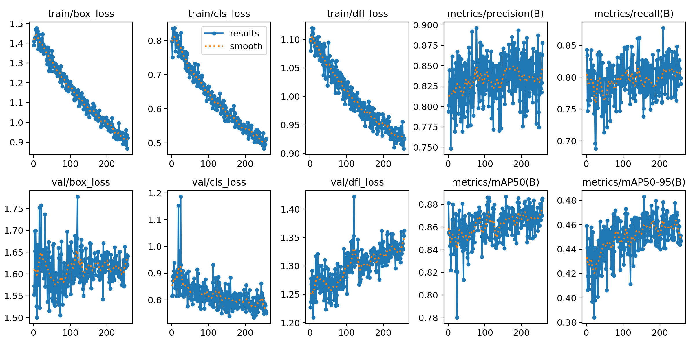
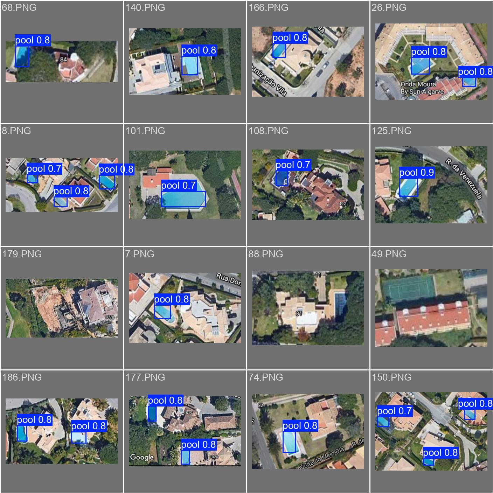
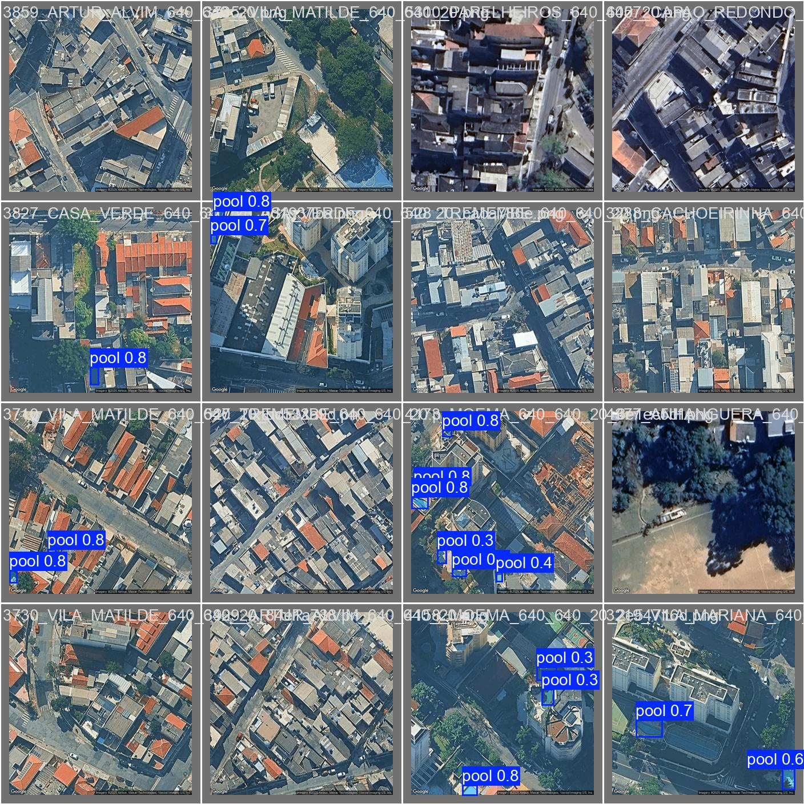
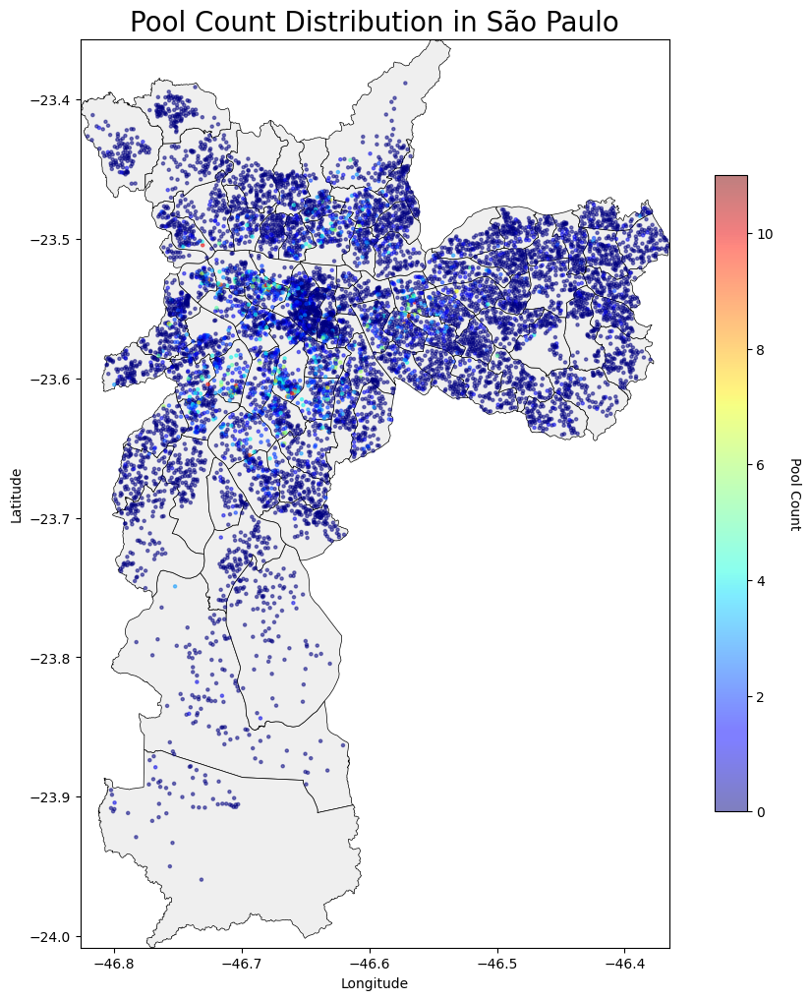
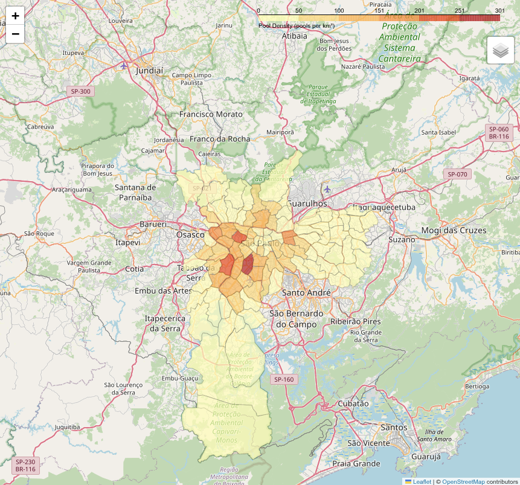
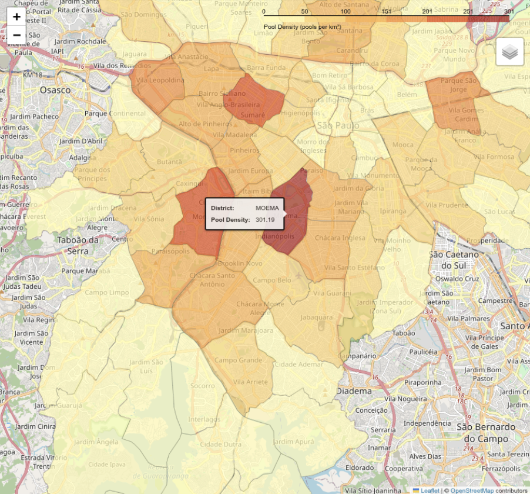
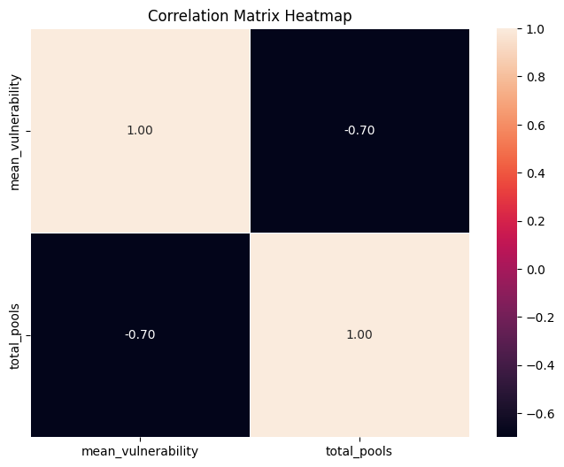
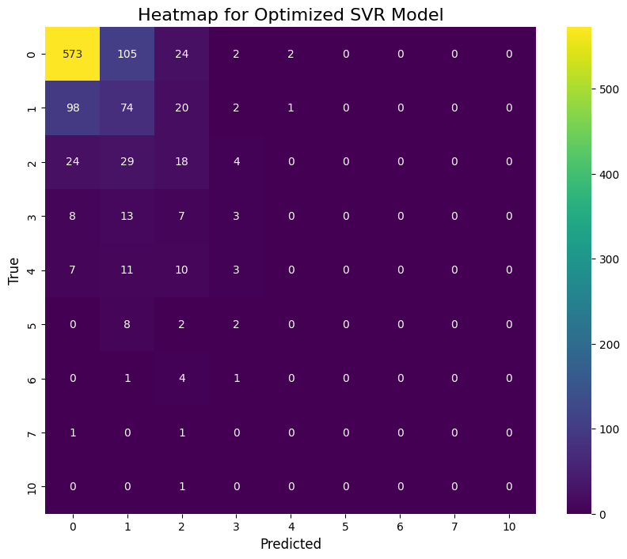

# How many pools are in São Paulo? 

This project leverages satellite imagery, computer vision and socioeconomic data to estimate the number of swimming pools in São Paulo. Our analysis reveals approximately 48621 pools across the city and explores the correlation between pool density and socioeconomic indicators.

### 1. Data
#### 1.1 Pool detection
Since this is an object detection task, the annotation corresponds to the bounding boxes of the target class, in this case there is just one: "pool".

The final dataset is a mix of Kaggle's "Swimming Pool detection - Algarve's Landscape" dataset (https://www.kaggle.com/datasets/cici118/swimming-pool-detection-algarves-landscape), that was used to train the base model and corresponds to 289 images, and images annotated by ourselves from Google Maps satellite images from São Paulo (1036), totalizing  1325 annotated images.

#### 1.2 São Paulo districs and socioeconomic features
The data was obtained from São Paulo's GeoSampa open data:
https://geosampa.prefeitura.sp.gov.br/PaginasPublicas/_SBC.aspx

We used the `geoportal_setor_censitario.geojson`, that corresponds to the socioeconomic data and for the districts' geometry `limites_adm_geoportal_distrito_municipal.geojson`

### 2. Model

#### 2.1 Task modeling
Since this is a counting problem the natural way of modeling it is through an object detector trained to locate the desired class' instances in the input image.

#### 2.2 Architecture
For the object detection task we chose to fine-tune YOLO v11 small due to its proven great detection capacities, small size, high throughput and ease to train.

#### 2.3 Training results
The final model was able to reach a mAP50 score of ~0.878 with confidence threshold = 0.25 and iou = 0.40

Some detections samples:

### 3. Pool count
São Paulo has approximately 48621 pools!

This count was obtained through the following process:

1. For each district, iterate over all its sample points and detect the pools in them using the trained detector

2. Find the total sampled area (km^2) by adding up the area of each sampled tile

3. Estimate the pool density (pools/km^2) for the district by dividing the pool count by the sampled area

4. Find each district's total pool count by multiplying its pool density by its area

5. Sum all district's pool count

To better interact with the folium map, just access `data/pool_density_map.html`

### 4. Can we predict pool count?
From `data/predict_pools.ipynb` we can notice that there is a negative correlation between a district's mean socioeconomic index (that ranges from 1 - great to 6 - very low) and its pool count, which makes sense intuitively:

#### Is it possible to predict the pool count of a point (latitude, longitude) and its socioeconomic index?

After experimenting with classical ML models, like Linear Regression, Random Forests and SVR, we found that we can somewhat model this relation. The best fitting model found through Grid Search was SVR, reaching 1.1088 RMSE on test set:

Even though this is naturally a regression problem, we can approximate it to a classification since the targets are discrete and limited:

The best SVR scored:
* 0.6308 Accuracy
* 0.6136 Precision (weighted)
* 0.6308 Recall (weighted)

Those results cannot be used directly since they need better metrics, but they indicate that predicting pool count using purely the coordinates and the index is a promising idea that can be further explored.

### 5. Steps to reproduce
#### 5.1 Setup the environment
Run `uv sync`

#### 5.2 Get stratified samples (by district)
1. Run `data/sample_districts.ipynb` to access the EDA and generate the sampled dataframes at `samples/*geojson`

2. Run `data/get_region_samples.py` to generate the `unified_points.csv`

3. Run `data/download_satellite_images.py` to download the satellite image tiles from the samples points

4. Run `models/train.ipynb` to train the object detector

5. Run `data/get_pool_count.ipynb` to access the pool count logic and visualization

6. Run `data/predict_pools.ipynb` to access the data analysis for the pool distribution, correlations and train regression models that predict pool count based on location and its socioeconomic index